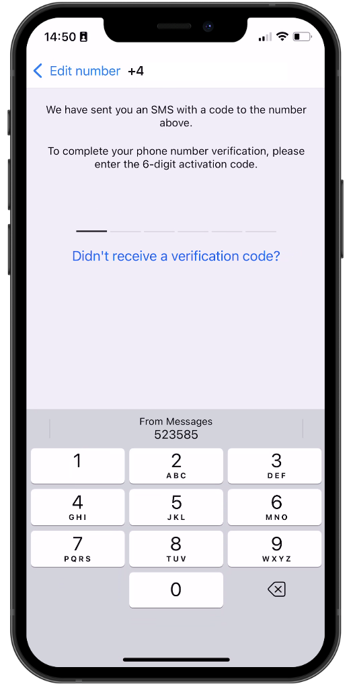
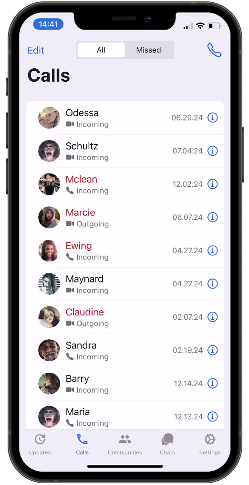

#  React Native Project Series  

Welcome to my **React Native Project Series** repository! 🎉  

This repository documents my journey as I learn and grow as a React Native developer by building various projects. From beginner-friendly apps to more complex solutions, this series showcases consistent learning, improvement, and experimentation.  

---

## About  

I started this journey to:  
- Strengthen my mobile development skills.  
- Learn by building real-world projects.  
- Share my progress with the developer community.  
- Encourage others to start their own learning journey!  

---

## Featured Projects  

| Project Name                  | Description                                                                 | Tech Stack                                   | Status           |
|-------------------------------|-----------------------------------------------------------------------------|----------------------------------------------|------------------|
| **Password Generator App**    | Generate secure passwords with custom options                               | React Native, TypeScript, Formik             | Completed ✅     |
| **Background Color Changer**  | Randomly changes the background color on a tap                              | React Native, State Management               | Completed ✅     |
| **WhatsApp Clone**            | React Native WhatsApp clone using [Clerk](https://clerk.com/?utm_source=sponsorship&utm_medium=github&utm_campaign=simong&utm_content=rn-whatsapp) for user authentication with OTP. | React Native, Expo Router, SMS OTP, Reanimated, Gesture Handler, Gifted Chat | Completed ✅     |
| **GIF Reaction Picker**       |  Users select an emotion and instantly see matching GIFs fetched live from the GIPHY API. Features dynamic GIF loading, endless refresh, favorites, and sharing. | React Native, TypeScript, Zustand, GIPHY API | Completed ✅     |
| **Next Project (Coming Soon)**| TBD                                                                         | React Native                                  | Coming Soon 🚧   | 

Stay tuned for more updates as I add new projects monthly, weekly or daily!  

---
## Tech Stack  
Here are the tools and technologies I used throughout this series:  
- **Expo**: For rapid prototyping and development workflow.  
- **React Native**: For building cross-platform mobile apps.  
- **TypeScript**: For writing scalable, type-safe code.  
- **Formik**: For form state management and validation.  
- **Expo Router**: For navigation and routing in Expo apps.  
- **Clerk**: For authentication (SMS OTP, user management).  
- **State Management**: Using React state and context for app logic.  
- **Custom Hooks**: For reusable logic across components.  
- **Git & GitHub**: For version control and collaboration.
- **Reanimated**: For smooth and performant animations.  
- **React Native Gesture Handler**: For handling complex gestures.  
- **React Native Section Alphabet List**: For displaying and navigating lists with alphabetical section headers, similar to contact lists in messaging apps.
- **Gifted Chat**: For building chat UIs.  


## Goals  

1. Complete 10+ React Native projects within the next few months.  
2. Master advanced mobile development concepts and best practices.  
3. Gain practical experience with popular React Native libraries and tools.  
4. Share code examples and insights with the developer community.  
5. Foster continuous learning and improvement through hands-on projects.  

---

### GIF Reaction Picker – Completion Report

**Status:** Completed ✅

**Description:**  
The GIF Reaction Picker app lets users select an emotion and instantly view a curated set of GIFs fetched live from the GIPHY API.  
- Dynamic GIF loading based on emotion  
- Endless refresh for new GIFs  
- Favorites and sharing support  
- Robust error handling and fallback GIFs  
- Powered by Zustand for state management

**Tech Highlights:**  
- React Native + Expo  
- TypeScript  
- Zustand  
- GIPHY API integration

**How it works:**  
1. Select an emotion card  
2. App fetches 25 GIFs from GIPHY using emotion-specific search terms  
3. Tap "New Reaction" to cycle through GIFs or fetch more  
4. Mark favorites and share GIFs

---


### Whatsapp Clone Project Screenshots

<div style="display: flex; flex-direction: 'row';">







</div>

### Whatsapp Clone Project Demo

<div style="display: flex; flex-direction: 'row';">


</div>


## Getting Started

> **Note**: Make sure you have cloned this repository using  
> ```bash
> git clone https://github.com/Eli-Keli/React-Native-Series.git
> cd React-Native-Series/projectname
> ```
> Replace `projectname` with the specific project folder you want to work on.

### Step 1: Install Dependencies

Navigate to the project directory and install the required dependencies:

```bash
npm install
# or
yarn install
```

### Step 2: Set Up Your Development Environment

- Ensure you have [Node.js](https://nodejs.org/) installed (preferably the latest LTS version).
- Install [Expo CLI](https://docs.expo.dev/get-started/installation/) globally if you haven't already:

    ```bash
    npm install -g expo-cli
    ```

- For iOS development, install Xcode and its command line tools.
- For Android development, install Android Studio and set up the Android SDK.

### Step 3: Start the Project

Run the following command to start the development server:

```bash
npx expo start
```

This will open the Expo Developer Tools in your browser/terminal. You can then:

- Scan the QR code with the Expo Go app on your mobile device (available on [iOS](https://apps.apple.com/app/expo-go/id982107779) and [Android](https://play.google.com/store/apps/details?id=host.exp.exponent)).
- Or, run the app on an emulator/simulator by selecting the appropriate option in the Expo Developer Tools.

### Step 4: Explore and Modify

- Browse the project files and start making changes.
- Hot reloading is enabled by default, so your changes will reflect instantly in the app.

### Step 5: Troubleshooting

- If you encounter issues, try clearing the cache:

```bash
npx expo start -c
```

- Check the [Expo documentation](https://docs.expo.dev/) or open an issue in this repository for help.

---


## 🌱 Contributing
Feel free to contribute by suggesting new project ideas, pointing out improvements, or providing feedback. Open an issue or submit a pull request—collaboration is welcome!

## Connect
Follow my progress and share your thoughts!

- [LinkedIn](https://www.linkedin.com/in/eli-keli/)
- [GitHub](https://github.com/Eli-Keli)

## Show Your Support
If you find this repository helpful or inspiring, please give it a ⭐ and share it with others!


